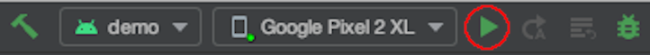

# Overview
This repository serves as a demonstration for the CardScan library. [CardScan](https://cardscan.io/) is a relatively small library that provides fast and accurate payment card scanning.

CardScan is the foundation for CardVerify enterprise libraries, which validate the authenticity of payment cards as they are scanned.


## Contents
* [Requirements](#requirements)
* [Demo](#demo)
* [Integration](#integration)
* [Customizing](#customizing)
* [Developing](#developing)
* [Authors](#authors)
* [License](#license)

## Requirements
* Android API level 21 or higher
* AndroidX compatibility
* Kotlin coroutine compatibility

Note: Your app does not have to be written in kotlin to integrate this library, but must be able to depend on kotlin functionality.

## Demo
This repository contains a demonstration app for the CardScan product. To build and install this library follow the following steps:

1. Clone the repository from github
    ```bash
    git clone --recursive https://github.com/getbouncer/cardscan-demo-android
    ```
    
2. Build the library using gradle or [android studio](https://developer.android.com/studio).
    a. Using android studio, open the directory `cardscan-demo-android`. Install the app on your device or an emulator by clicking the play button in the top right of android studio.
    
    
    
    b. Using gradle, build the demo app by executing the following command:
    
    ```bash
    ./gradlew demo:assembleRelease
    ```
    This will create a release APK in the `cardscan-demo/build/outputs/apk` directory. Copy this file to your device and install it.

## Integration
See the [integration documentation](https://docs.getbouncer.com/card-scan/android-integration-guide/android-development-guide) in the Bouncer Docs.

### Provisioning an API key
CardScan requires a valid API key to run. To provision an API key, visit the [Bouncer API console](https://api.getbouncer.com/console).

### Name and expiration extraction support (BETA)
To test name and/or expiration extraction, please first provision an API key, then reach out to [bouncer-support@stripe.com](mailto:bouncer-support@stripe.com) with details about your use case and estimated volumes.

Before launching the CardScan flow, make sure to call the ```CardScanActivity.warmup()``` function with your API key and set ```initializeNameAndExpiryExtraction``` to ```true```

```kotlin
CardScanActivity.warmup(this, API_KEY, true)
```

## Customizing
CardScan is built to be customized to fit your UI.

### Basic modifications
To modify text, colors, or padding of the default UI, see the [customization](https://docs.getbouncer.com/card-scan/android-integration-guide/android-customization-guide) documentation.

### Extensive modifications
To modify arrangement or UI functionality, CardScan can be used as a library for your custom implementation. See the [example single-activity demo app](demo/src/main/java/com/getbouncer/cardscan/demo/SingleActivityDemo.java).

## Developing
See the [development docs](https://docs.getbouncer.com/card-scan/android-integration-guide/android-development-guide) for details on developing for CardScan.

## Authors
Adam Wushensky, Sam King, and Zain ul Abi Din

## License
This library is available under paid and free licenses. See the [LICENSE](../LICENSE) file for the full license text.

### Quick summary
In short, this library will remain free forever for non-commercial applications, but use by commercial applications is limited to 90 days, after which time a licensing agreement is required. We're also adding some legal liability protections.

After this period commercial applications need to convert to a licensing agreement to continue to use this library.
* Details of licensing (pricing, etc) are available at [https://cardscan.io/pricing](https://cardscan.io/pricing), or you can contact us at [bouncer-support@stripe.com](mailto:bouncer-support@stripe.com).

### More detailed summary
What's allowed under the license:
* Free use for any app for 90 days (for demos, evaluations, hackathons, etc).
* Contributions (contributors must agree to the [Contributor License Agreement](../Contributor%20License%20Agreement))
* Any modifications as needed to work in your app

What's not allowed under the license:
* Commercial applications using the license for longer than 90 days without a license agreement. 
* Using us now in a commercial app today? No worries! Just email [bouncer-support@stripe.com](mailto:bouncer-support@stripe.com) and we’ll get you set up.
* Redistribution under a different license
* Removing attribution
* Modifying logos
* Indemnification: using this free software is ‘at your own risk’, so you can’t sue Bouncer Technologies, Inc. for problems caused by this library

Questions? Concerns? Please email us at [bouncer-support@stripe.com](mailto:bouncer-support@stripe.com) or ask us on [slack](https://getbouncer.slack.com).
