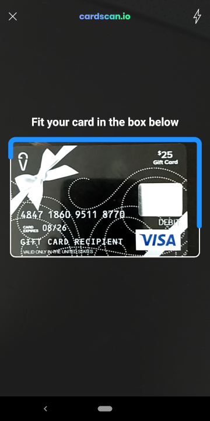
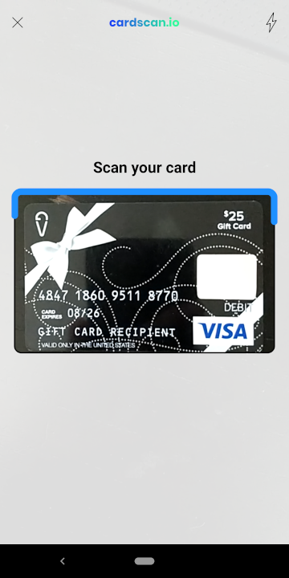
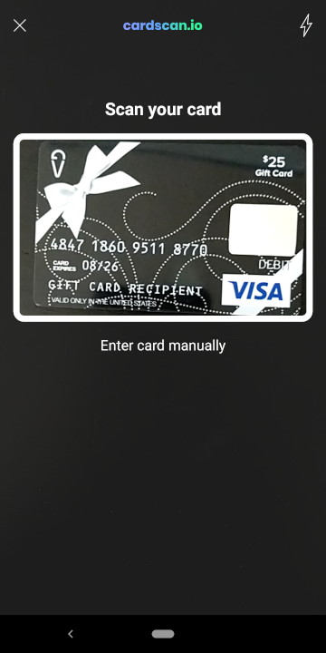
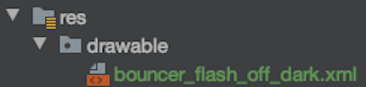
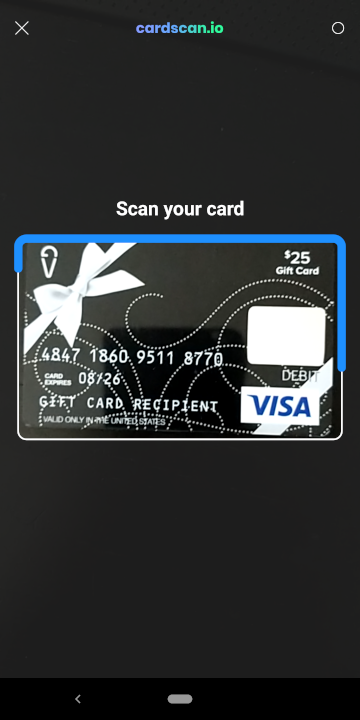
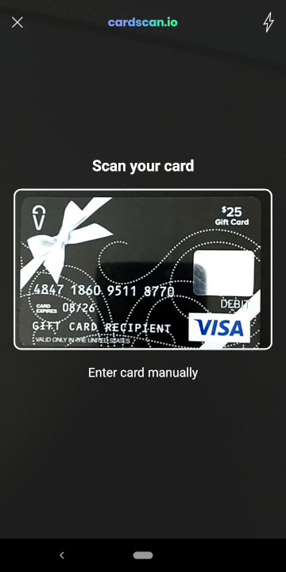

# Customization

This document describes how to customize CardScan to fit your user interface design.

## Contents

* [Text](#text)
* [Colors](#colors)
* [Dimensions](#dimensions)
* [Icons](#icons)
* [Screen Elements](#screen-elements)

## Text

Text values are stored in the [`strings`](../cardscan-ui/src/main/res/values/strings.xml) resource file. To change the value of any of these strings, you can override them in your app.

Add strings with the same names to your app's resources (`src/main/res/values/strings.xml`) and CardScan will pick up the values you specified.

Example:
```xml
<resources>
    <string name="bouncer_card_scan_instructions">Fit your card in the box below</string>
</resources>
```



## Colors

CardScan uses colors defined in the [`colors`](../cardscan-ui/src/main/res/values/colors.xml) resource file. To change the value of any of these colors, you can override them in your app.

Add colors with the same names to your app's resources (`src/main/res/values/colors.xml`) and CardScan will pick up the values you specified.

Example:
```xml
<resources>
    <color name="bouncerNotFoundBackground">#DDFFFFFF</color>
    <color name="bouncerFoundBackground">#DDFFFFFF</color>
    <color name="bouncerCorrectBackground">#DDFFFFFF</color>
    <color name="bouncerWrongBackground">#DDFFFFFF</color>

    <color name="bouncerNotFoundOutline">#000000</color>
    <color name="bouncerFoundOutline">#1E90FF</color>
    <color name="bouncerCorrectOutline">#2ED573</color>
    <color name="bouncerWrongOutline">#FF2222</color>
</resources>
```



## Dimensions

Padding, text size, and other dimension values are stored in the [`dimensions`](../cardscan-ui/src/main/res/values/dimensions.xml) resource file. To change the size
of any of these dimensions, you can override them in your app.

Add dimensions with the same names to your app's resources (`src/main/res/values/dimensions.xml`) and CardScan will pick up the values you specified.

Example:
```xml
<resources>
    <dimen name="bouncerViewFinderVerticalBias">0.3</dimen>
    <dimen name="bouncerNotFoundOutlineWidth">4</dimen>
</resources>
```



## Icons

Icons are defined in the [`drawable`](../cardscan-ui/src/main/res/drawable) directory. To replace any of these icons in your app, create a new drawable in your app with the same name as the icon you wish to replace.

Example:





## Screen Elements

Screen elements can be turned on and off when launching the CardScan flow. The following options are available:

* `Enter Card Manually` button which will close the scan window and notify the app that the user wishes to enter a card manually.
* `Display Card Pan` will show the full number of the card as it is being scanned.
* `Display CardScan Logo` will display the CardScan logo at the top of the screen.
* `Required Card Number` if provided, will only allow users to scan cards matching the specified number.

Example:

```java
findViewById(R.id.scanCardButton).setOnClickListener(v ->
    CardScanActivity.start(
        /* activity */ LaunchActivity.this,
        /* apiKey */ API_KEY,
        /* enableEnterCardManually */ true,
        /* displayCardPan */ true,
        /* requiredCardNumber */ "4847186095118770",
        /* displayCardScanLogo */ true,
        /* enableDebug */ false
    )
);
```


