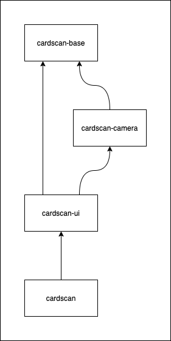

# Development

cardscan development guide

## Contents

* [Code Organization](#code-organization)
* [Building](#building)
* [Running Unit Tests](#running-unit-tests)
* [Using Running Android Tests](#running-android-tests)
* [Releasing](#releasing)

## Code Organization

This android library builds on top of the framework in the [CardScan base library](https://github.com/getbouncer/cardscan-base-android) to provide user interfaces for scanning payment cards. Anything specific to the user interface of the CardScan product lives in this library.



CardScan consists of these modules and a demo app:
* [cardscan-base](https://github.com/getbouncer/cardscan-base-android)
* [cardscan-camera](https://github.com/getbouncer/cardscan-camera-android)
* [cardscan-ui](https://github.com/getbouncer/cardscan-ui-android)
* [cardscan](https://github.com/getbouncer/cardscan-android)


### cardscan base

[CardScan Base](https://github.com/getbouncer/cardscan-base-android) contains the framework and machine learning models used to scan cards. See the [architecture document](https://github.com/getbouncer/cardscan-base-android/blob/master/docs/architecture.md) for details on how CardScan processes images from the camera.

### cardscan camera

[CardScan Camera](https://github.com/getbouncer/cardscan-camera-android) contains the camera interfaces for setting up the camera on the device and receiving images from it. It also handles converting the images from the camera to a processable format.

### cardscan ui

[CardScan UI](https://github.com/getbouncer/cardscan-ui-android) contains some common functionality shared between user interfaces. This provides the card viewfinder, debug overlay, and base scan activity.

### cardscan

[CardScan](https://github.com/getbouncer/cardscan-android) provides a user interface for scanning payment cards. The demo uses this to capture a card to later verify. See the [CardScan Demo](https://github.com/getbouncer/cardscan-demo-android) for more details.

## Building

Check out the project using `git`. Note that this project makes use of submodules, so a `recursive` clone is recommended.
```bash
git clone --recursive https://github.com/getbouncer/cardscan-android
```

To build the project, run the following command:
```bash
./gradlew cardscan:build
```

To create an AAR release of the app, run the following command:
```bash
./gradlew cardscan:assembleRelease
```
This will place an AAR file in `cardscan/build/outputs/aar`

## Contributing

CardScan libraries follow a standard github contribution flow.

1. Create a new github feature branch
    ```bash
    git checkout -b <your_github_name>/<your_feature_name>
    ```

1. Make your code changes

1. Push your branch to origin
    ```bash
    git push --set-upstream origin <your_branch_name>
    ```

1. Create a new pull request on github, and tag appropriate owners.

1. Once you have approval, merge your branch into master and delete your feature branch from github.

## Running Unit Tests

Unit tests can be run from android studio or from the command line. To execute from the command line, run the following command:
```bash
./gradlew test
```

## Running Android Tests

Android tests can be run from android studio or from the command line. To execute from the command line, run the following command:
```bash
./gradlew connectedAndroidTest
```

Note that these tests require that you have an emulator running or a physical device connected to your machine via `ADB`.

## Releasing

See the [release](release.md) documentation.
